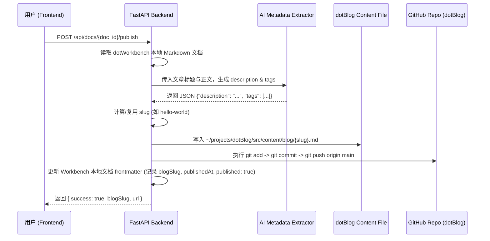

# dotWorkbench 到 dotBlog 一键发布功能设计规范 (Design Spec)

## 1. 概述
在 `dotWorkbench` 编辑器中新增“发布到博客”功能。用户在编辑 Markdown 文章时，只需点击顶部工具栏的“🚀 发布到博客”按钮，系统将自动调用 AI 智能提取文章的 `description`（摘要）与 `tags`（标签），并转换写入 `~/projects/dotBlog` 的 content 目录，最后通过 `git push` 将变更推送到 GitHub 仓库（`git@github.com:lucyfer81/dotBlog.git`），从而触发 Cloudflare Pages / CI 的自动构建与发布。

---

## 2. 核心架构与数据流



---

## 3. 后端服务与 API 设计

### 3.1 发布服务模块 (`src/dotworkbench/services/publish_service.py`)
- **`generate_metadata(title: str, content: str) -> dict`**
  - 利用自带 AI 能力分析文章内容，提取精炼摘要（100字以内）与 3-5 个高相关度标签。
  - 若 AI 调用异常，回退降级为截取正文前 100 字作为 `description`，默认 `tags: ["Blog"]`。

- **`get_or_create_slug(title: str, existing_slug: str | None) -> str`**
  - 如果文档 Frontmatter 中已存在 `blogSlug`，优先直接复用（实现**覆盖更新**）。
  - 否则将 `title` 转换为连字符分隔的 slug（如拼音/英文字符），确保为合法文件名。

- **`publish_doc(doc_id: str) -> dict`**
  1. 调用 `DocService.get_doc(doc_id)` 获取文档。
  2. 生成标准 Astro 博客 Frontmatter Markdown 内容：
     ```markdown
     ---
     title: "文章标题"
     description: "AI 生成摘要"
     publishDate: YYYY-MM-DD
     tags: ["Tag1", "Tag2"]
     cover: ""
     draft: false
     ---
     (文章正文)
     ```
  3. 保存至 `/home/ubuntu/projects/dotBlog/src/content/blog/{slug}.md`。
  4. 在 `/home/ubuntu/projects/dotBlog` 下执行 Git 部署操作：
     - `git add src/content/blog/{slug}.md`
     - `git commit -m "publish(blog): {title}"`
     - `git push origin main`
  5. 调用 `DocService.update_doc`，在原文档 Frontmatter 中持久化更新：`published: true`、`blogSlug: {slug}`、`publishedAt: {iso_timestamp}`。

### 3.2 API 路由 (`src/dotworkbench/main.py`)
- **`POST /api/docs/{doc_id}/publish`**
  - 请求：无 Body 参数，URL Path 传入 `doc_id`。
  - 响应：
    ```json
    {
      "success": true,
      "message": "文章已成功发布并推送至 GitHub！",
      "blogSlug": "hello-world",
      "publishedAt": "2026-08-06T17:08:00Z"
    }
    ```

---

## 4. 前端 UI 与交互设计

### 4.1 顶部栏组件 (`Header.tsx` / `DocHeader.tsx`)
- 在编辑器上方增加顶部工具栏，包含：
  - 文档标题显示与重命名输入（可选）。
  - 发布状态 Badge（`未发布` / `已发布 2026-08-06`）。
  - **`🚀 发布到博客`** 按钮：
    - AFFiNE 风格视觉高亮按钮。
    - 点击后进入禁用 Loading 状态，展示动画与进度文案（`✨ AI 分析与 Git 推送中...`）。

### 4.2 Toast 提示与交互反馈
- **成功**：弹出绿底 Toast：`🎉 发布成功！已推送至 dotBlog 仓库，Cloudflare 正在构建部署`。
- **失败**：弹出红底 Toast：`❌ 发布失败：{错误原因}`，按钮恢复可点击状态。

---

## 5. 异常处理与边界情况

1. **Git 冲突或网络异常**：`subprocess` 捕捉 git 执行的 `stderr`，友好封装为 HTTPException (500) 返回给前端，并在后端记录日志。
2. **文本过短**：正文少于 10 字时前端拦截提示“文章内容过少，暂无法发布”。
3. **覆盖更新保障**：在 Workbench 文档 Frontmatter 中记录 `blogSlug`，多次发布同一篇文档均更新对应的 `src/content/blog/{slug}.md`。

---

## 6. 测试与验证计划

1. **单元/服务测试**：验证 `PublishService` 转换 frontmatter 与 slug 生成的正确性。
2. **端到端发布验证**：测试创建新文档、编辑内容、点击发布按钮，检查 `~/projects/dotBlog/src/content/blog/` 下的文件及 `git status` 提交状态。
